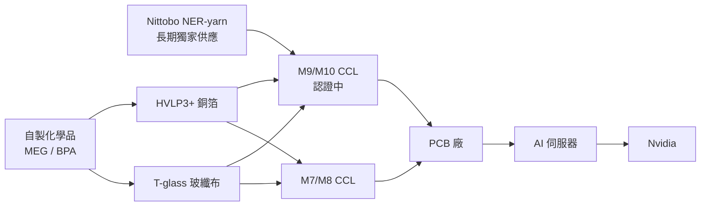

# 1303_南亞（市）

## 基本資料

南亞塑膠工業股份有限公司（Nan Ya Plastics Corp., 1303.TW），台塑集團四寶之一，台灣電子材料與石化中游的核心企業。傳統業務為塑膠加工、化學品（MEG、BPA）與電子材料，正進入由 AI 高階材料驅動的結構性轉型期。

> 投資主敘事：AI 高階材料結構性轉型（JPM 2026-06-21）
>
> 2025 年以前南亞超過 90% 電子材料為**商品級**（M4/M6 CCL、E-glass 玻纖布），毛利受景氣循環擺布。2026–2028 進入 AI 級高階材料（M7+ CCL、T-glass、HVLP3+ 銅箔）放量期，**JPM 預估 2028 年 AI 級產品比重將突破 50%**，並把南亞從循環股重定位為 AI 受惠的 re-rating 標的。

- 主要業務：電子材料（CCL、玻纖布、銅箔）+ 化學品（MEG、BPA）+ 塑膠加工
- 競爭定位：台塑集團垂直整合（上游原料自製）+ 由商品級 CCL／玻纖布升級至 M7+ AI CCL 級
- 供應鏈位置：AI 伺服器 PCB 上游材料供應商；Nvidia M10 樣品送樣 3 家之一
- 資料來源：J.P. Morgan《Nan Ya Plastics — Structural transformation to AI grade materials》2026-06-21；配套來源頁 [[報告_JPM_南亞_AI高階材料_20260621]]

## 核心技術／競爭優勢

- **M7+ CCL 升級**：南亞已切入 M7/M8 供應鏈並開始放量；升級至 M7/M8 可拉高單價 30–80%；若進一步通過 M9 認證，**單價提升幅度將超過 5 倍**。
- **T-glass 玻纖布／HVLP3+ 銅箔**：AI 伺服器三大關鍵材料中，南亞同時切入 CCL、玻纖布與銅箔，垂直整合度為國內同業少見。
- **與日東紡（Nittobo）戰略合作**：含 **NER-yarn 紗線**長期獨家供應協議，原料專供南亞自製 CCL；NER-yarn 為 M9 CCL 關鍵材料，此合作大幅擴展南亞在 M9 市場的潛在 TAM。
- **Nvidia M10 樣品送樣 3 家之一**：在最高階 AI CCL 認證中具一線地位。

## 產品與應用

| 產品 / 服務 | 應用 | 相關客戶 / 下游 |
| --- | --- | --- |
| M7/M8 CCL | AI 伺服器 PCB | PCB 廠 / Nvidia 供應鏈 |
| M9/M10 CCL（認證中） | 次世代 AI 伺服器 PCB | [[NVDA.US(nvidia)]]（樣品送樣 3 家之一） |
| T-glass 玻纖布 | AI 伺服器、高速基板 | CCL 廠 |
| HVLP3+ 銅箔 | AI 伺服器、高速基板 | CCL 廠 |
| MEG / BPA / 塑膠加工 | 石化、消費品 | 一般工業客戶 |

## 圖片 / 架構圖

> 南亞 AI 高階材料垂直整合架構：自製化學品 + Nittobo NER-yarn → T-glass 玻纖布與 HVLP3+ 銅箔 → M7/M8 與 M9/M10 CCL → PCB 廠 → AI 伺服器。垂直整合為國內 CCL 同業少見的競爭優勢。

## AI 高階材料結構性轉型（JPM 2026-06-21）

JPM 把南亞定位為「商品電子材料廠 → AI 高階材料廠」的結構性轉型案例：

- **產品結構升級**：2025 以前 >90% 電子材料屬商品級（M4/M6、E-glass），2026–2028 高階 AI 材料（M7+ CCL、T-glass、HVLP3+）營收比重快速拉升，**2028 年 AI 級比重突破 50%**。
- **CCL 單價跳升**：M6 升 M7/M8 → 單價 +30–80%；若升 M9 → 單價提升 **>5 倍**。
- **電子材料 OPM 創歷史新高**：在伺服器超級循環（Server Supercycle）+ 產能轉換損失（15–60%）兩股推力下，JPM 預測南亞電子材料營業利益率將在 **2Q28 達到 28% 的歷史新高**。

## 關鍵催化劑（JPM 2026-06-21）

- **Nvidia M9/M10 認證**：南亞已被列入 **Nvidia M10 樣品送樣 3 家廠商之一**；2H26 進行客戶驗證、2027 正式貢獻營收與獲利。**此為觸發估值 re-rating 的最關鍵催化劑**。
- **日東紡 NER-yarn 長期獨家供應協議**：擴大南亞自製 M9 CCL 的 TAM。
- **銅箔擴產**：高利潤產能陸續開出，主要銅箔擴產預計 **1Q27 動工**。

## EPS 預估

| 指標（NT\$mn） | FY25A | FY26E | FY27E | FY28E |
| --- | --- | --- | --- | --- |
| 總營收 | 259,912 | 304,503 | 376,983 | 419,829 |
| 電子材料營收 | 120,618 | 175,465 | 247,227 | 288,765 |
| 營業利益（EBIT） | 3,704 | 29,591 | 57,883 | 77,611 |
| 稅後純益 | 4,519 | 68,454 | 106,347 | 120,294 |
| EPS（NT\$） | 0.57 | 8.63 | **13.41** | **15.17** |
| ROE | 1.3% | 18.7% | 27.2% | 28.9% |
| DPS（NT\$） | 0.80 | 6.04 | 10.06 | 12.13 |

- 來源：J.P. Morgan Estimates，2026-06-21。
- ⚠️ EPS 由 FY25 0.57 跳升至 FY26 8.63（+15 倍）、FY27 13.41，隱含「AI CCL 放量 + Server Supercycle + 產能轉換損失轉為效益」的多重假設成立；屬單一券商樂觀預估，**需後續主流券商（MS、UBS、HSBC）與實際季報交叉驗證**。

## 目標價與評等

| 券商 | 報告發布日 | 評等 | 目標價 | 前目標價 | 評價基礎 | 來源 |
| --- | --- | --- | --- | --- | --- | --- |
| J.P. Morgan | 2026-06-21 | **Overweight** | **NT\$200** | NT\$125 | 4x P/B（歷史 10 年均 1.6x），反映 2028E ROE 接近 30% | [[報告_JPM_南亞_AI高階材料_20260621]] |

> JPM 大幅上調目標價（2026-06-21）
>
> 目標價自 **NT\$125 上調至 NT\$200**（+60%）。評價基礎改採 4x P/B（歷史 10 年平均僅 1.6x），反映 2028E 預期 ROE 接近 30%。即使股價達 NT\$200，依 2027E DPS NT\$10.06 計算，**隱含現金殖利率仍達 5%**——estimate ROE 與殖利率雙高，是 thesis 主要支撐。

## 供應鏈位置

- 所屬供應鏈：[[供應鏈_AI伺服器]]（CCL／玻纖布／銅箔上游材料）
- 上游：[[Nittobo（未）]]（NER-yarn 紗線長期獨家供應）；台塑集團自製化學品
- 下游客戶：CCL 客戶 → PCB 廠 → Nvidia AI 伺服器供應鏈

## 相關公司

| 公司 | 關係 | 說明 |
| --- | --- | --- |
| [[NVDA.US(nvidia)]] | 客戶 | M10 樣品送樣 3 家廠商之一；2H26 客戶驗證、2027 量產貢獻為核心催化劑 |
| [[Nittobo（未）]] | 戰略合作夥伴 | NER-yarn 紗線長期獨家供應，專供南亞自製 M9 CCL |
| [[2383_台光電（市）]] | 同業 | AI 高階 CCL 主要競爭對手；M8/M9 認證進度為相對比較主軸 |
| [[6213_聯茂（市）]] | 同業 | 高速 CCL 競爭者 |

## 時間軸

| 時間 | 事件 | 類型 | 信心 | 來源 |
| --- | --- | --- | --- | --- |
| 2026-06-21 | JPM 升評 / 重申 Overweight、TP NT\$125 → NT\$200 | 評等 | ⭐⭐⭐ | [[報告_JPM_南亞_AI高階材料_20260621]] |
| 2H26 | Nvidia M10 客戶驗證 | catalyst | ⭐⭐ | [[報告_JPM_南亞_AI高階材料_20260621]] |
| 1Q27 | 主要銅箔擴產動工 | capex | ⭐⭐ | [[報告_JPM_南亞_AI高階材料_20260621]] |
| 2027 | Nvidia M10 量產貢獻營收（若認證通過） | estimate | ⭐⭐ | [[報告_JPM_南亞_AI高階材料_20260621]] |
| 2Q28 | 電子材料 OPM 預估達 28% 歷史新高 | estimate | ⭐⭐ | [[報告_JPM_南亞_AI高階材料_20260621]] |
| 2028 | AI 級電子材料營收占比預估突破 50% | estimate | ⭐⭐ | [[報告_JPM_南亞_AI高階材料_20260621]] |

## 下行風險

- 全球 AI 與資料中心資本支出減速
- 次世代電子高階材料認證進度不如預期（M9/M10 認證延遲將直接衝擊 re-rating thesis）
- 傳統商品級化學品（MEG/BPA）受宏觀經濟或關稅影響導致需求低迷

## 來源

- J.P. Morgan《Nan Ya Plastics (1303.TW) — Structural transformation to AI grade materials》Asia Pacific Equity Research，2026-06-21（Overweight、TP NT\$125→200；AI 級營收占比 2028 突破 50%；M9 CCL ASP +5x；2Q28 OPM 28% 歷史新高；Nvidia M10 樣品送樣 3 家之一；Nittobo NER-yarn 長期獨家供應；1Q27 銅箔擴產動工）
- 配套來源頁：[[報告_JPM_南亞_AI高階材料_20260621]]（建議於 `data_base/報告/` 建立 metadata trimmed Markdown）

## 相關頁面

- [[2383_台光電（市）]]
- [[6213_聯茂（市）]]
- [[供應鏈_AI伺服器]]
- [[技術_CCL]]
- [[技術_玻纖布]]
- [[技術_銅箔]]
