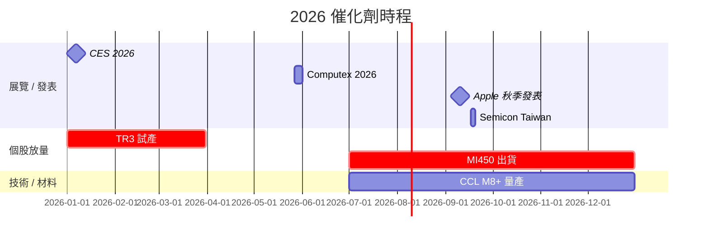

# Schema：時程頁 (lib/5.schedule/)

> **定位**：統一的日期表，將**產業大事**（Apple 發表會、Computex、CES、Semicon）與**個股關鍵節點**（放量、驗證、出貨高峰）放在同一個時間軸上，方便對照催化劑與持股。

---

## Frontmatter 規範

```yaml
---
title: 時程_2026
year: 2026
tags:
  - 時程/放量
  - 時程/展覽
  - 公司/台積電
updated: 2026-05-06
---
```

> 命名可按年度（`時程_2026`）、主題（`時程_AI算力`）或標的（`時程_2026-2027台光電`）建檔。

---

## 事件類型

| 類型 | 說明 | 範例 |
|------|------|------|
| 展覽 | 產業大展 | CES、Computex、Semicon、Hot Chips |
| 發表會 | 品牌/廠商新品發表 | Apple WWDC、NVIDIA GTC、AMD Next Horizon |
| 放量 | 個股出貨量放大節點 | TR3 放量、MI450 放量、GB300 機架出貨 |
| 出貨高峰 | 個股出貨高峰期 | CoWoS N3 出貨高峰 |
| 技術下線 | 新製程正式量產 | 台積電 2nm 量產 |
| 驗證 | 客戶認證通過節點 | 天虹 ALD 客戶驗證 |
| 規格升級 | 材料 / 零件世代切換 | CCL 升 M8+ |

---

## 內容結構

```markdown
# 時程_[年度或主題]

## 日期表

| 日期 | 事件 | 相關公司 | 類型 | 重要性 | 備註 |
|------|------|---------|------|--------|------|
| 2026-01-07 | CES 2026 | — | 展覽 | ⭐⭐ | AI PC / 車用晶片方向 |
| 2026Q1 | TR3 小量試產 | [[1234_公司名（市）]] | 放量 | ⭐⭐⭐ | （預估） |
| 2026-05-27 | Computex 2026 | — | 展覽 | ⭐⭐⭐ | NVIDIA 新架構、供應鏈訂單 |
| 2026Q3 | MI450 正式出貨 | [[5678_公司名（櫃）]] | 放量 | ⭐⭐⭐ | （預估） |
| 2026-09 | Apple 秋季發表會 | — | 發表會 | ⭐⭐ | iPhone 17 系列 |
| 2026H2 | 規格升級量產 | [[1234_公司名（市）]] | 規格升級 | ⭐⭐⭐ | 來源揭露的投資重點 |
| 2026-09 | Semicon Taiwan | — | 展覽 | ⭐⭐ | 設備廠動向 |

## Gantt 時程圖


```

---

## 注意事項
- `title` 以 `時程_` 開頭
- 日期格式：已知確切日期用 `YYYY-MM-DD`；季度用 `2026Q3`；上下半年用 `2026H2`
- 未確認節點加 `（預估）`
- **每頁必須包含 Mermaid gantt 圖**
- 重要性：⭐⭐⭐ 高度關注、⭐⭐ 一般、⭐ 參考
- 個股節點同步寫入對應公司頁「時間軸」（見 schema_company.md）
