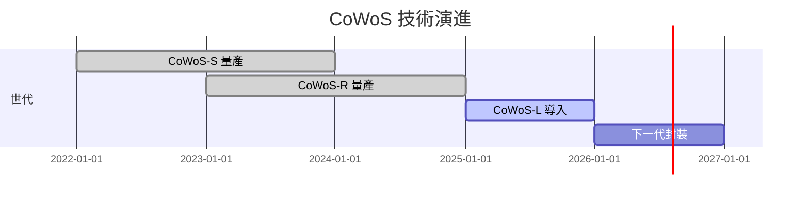

# Schema：技術頁 (lib/2.tech/)

## Frontmatter 規範

```yaml
---
title: 技術_CoWoS
tags:
  - 技術/CoWoS
  - 供應鏈/CoWoS
  - 環節/封測
  - 產業/AI伺服器
maturity: developing        # early / developing / mature
updated: 2026-05-02
aliases:
  - CoWoS
  - Chip on Wafer on Substrate
---
```

## Aliases 與技術標籤規則

技術頁應主動把常見英文縮寫、中文名、全名、產品規格與細項元件放入 `aliases`，讓後續 ingest / query 可以穩定導回同一頁。

- **遇到就主動補 aliases**：ingest 或更新頁面時，只要來源出現可歸入既有技術頁的細項術語、同義詞、產品規格、元件名稱、英文縮寫，就應主動補入該頁 `aliases`，例如 `EML`、`FBG`、`CW Laser`、`ELSFP`、`Paddle Card`。
- **不要先建 tag，但要主動推薦**：不要為每個細項術語建立 `#技術/FBG`、`#技術/EML` 這類碎片化標籤，避免 label_dic 膨脹與搜尋噪音；但若判斷該主題已值得獨立查詢，需主動推薦新標籤，而不是默默沿用母標籤。
- **何時拆頁 / 拆 tag**：當某個術語累積多份來源、具備獨立原理/供應鏈/投資觀察，或需要獨立查詢與比較時，**主動向使用者提案推薦**建立 `技術_XXX` 頁與 `#技術/XXX`，使用者同意後建立。
- **推薦話術**：建立獨立技術頁但尚未新增標籤時，需明確說：「這個主題已可獨立查詢，建議新增 `#技術/XXX` 到 label_dic，要我一起建立嗎？」
- **查重優先順序**：新增技術頁前，先查 `title`、`aliases`、正文關鍵詞與 `index_tech_supply.md`；若既有頁 aliases 已涵蓋，優先更新該頁，不另建新頁。

## 內容結構範例（技術_CoWoS）

```markdown
# 技術_CoWoS

## 定義
CoWoS（Chip on Wafer on Substrate）是台積電的 2.5D 先進封裝技術，
將多個晶片（HBM、SoC）整合在同一個矽中介層上，大幅縮短訊號傳輸路徑並降低功耗。

## 圖解
![[CoWoS_structure.png]]

> 若來源沒有可用圖片，至少補一張 Mermaid 技術架構圖或流程圖。

## 技術原理
三代演進：
- **CoWoS-S**：矽中介層（Silicon Interposer），成本高，性能最好
- **CoWoS-R**：RDL 中介層，成本較低
- **CoWoS-L**：Local Silicon Interconnect，平衡方案

關鍵結構：晶片 / HBM → 中介層或重佈線互連 → 微凸塊 / 混合鍵合等封裝互連 → 基板 → 系統模組。

> 注意：CoWoS 與 TGV / 玻璃基板是不同技術系統，不可把 TGV 鑽孔或玻璃通孔當成 CoWoS 的預設關鍵製程。

## 關鍵參數 / 判斷指標
| 指標 | 意義 | 觀察重點 |
|------|------|----------|
| 中介層尺寸 | 可整合晶片與 HBM 的面積 | reticle limit、良率、成本 |
| HBM 堆疊數 | 記憶體頻寬與容量 | HBM3e/HBM4 導入節奏 |
| 基板層數與材料 | 影響訊號完整性與供應瓶頸 | ABF、高階 CCL、玻璃基板替代可能 |

## 技術瓶頸 / 風險
- 產能瓶頸：先進封裝設備、基板、HBM 供給需同步擴張。
- 成本與良率：大型中介層與高密度互連提高製造難度。
- 替代方案：FOPLP、SoIC、玻璃基板等技術可能在不同應用場景分流需求。

## 關鍵廠商

| 環節 | 廠商 | 角色 |
|------|------|------|
| 先進封裝平台 | [[2330_台積電（市）]] | CoWoS 製造主導 |
| 封測 / 先進封裝服務 | [[3711_日月光投控（市）]] | 封測與先進封裝服務追蹤 |
| 設備 / 自動化 | [[6187_萬潤（市）]] | 先進封裝相關設備追蹤 |

## 技術演進時程



## 應用場景
- AI 訓練加速器（H100、H200、B200 均採用）
- 高效能運算（HPC）

> [!info] 技術瓶頸
> - 產能受限：CoWoS 產能為稀缺資源，2024-2025 供不應求
> - 成本：比傳統封裝貴 3-5 倍

## 相關技術
- [[技術_HBM]]
- [[技術_CPO]]

## 供應鏈
→ [[供應鏈_CoWoS]]
```

## 注意事項
- `title` 以 `技術_` 開頭
- 技術頁內容要比摘要更深入：至少說明定義、技術原理/流程、關鍵參數、應用場景、瓶頸/風險、相關技術與關鍵廠商
- 遇到細項術語與同義詞時，需主動補進 `aliases`，讓 `FBG`、`EML`、`CW Laser` 這類詞能導回母技術頁；不要因單次出現就新增大量技術 tag
- 技術頁**必須含圖**：優先使用來源圖片或擷取圖；沒有可用圖片時，補 canvas 圖（演進時程、流程圖或技術架構）
- 若來源圖片能幫助理解結構、製程、材料堆疊、規格差異，應嵌入圖片並加 1-2 行圖說
- 廠商欄位用 wikilink，有完整供應鏈時建立 `[[供應鏈_XXX]]` 連結
